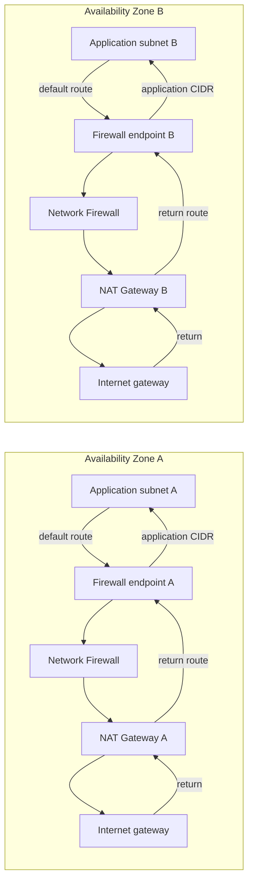

# Compose with AWS IA VPC v5

AWS IA VPC v5 and Network Firewall v2 compose through stable AZ-keyed maps. VPC
v5 owns network primitives; Network Firewall owns endpoint mappings; one route
owner consumes endpoint IDs after both directions are designed.

## Ownership boundary

| Concern | Recommended owner |
|---|---|
| VPC, CIDR, subnets, route tables, associations, NAT Gateways, IGW | `aws-ia/vpc/aws` v5 |
| Firewall placement and endpoint lifecycle | Network Firewall root module |
| Rule-group structure/content | `modules/rule-groups` or an explicitly external owner |
| Immutable policy releases and incident posture | `modules/policy-control` |
| Native VPC v5 route tables | VPC v5 top-level `routes` or subnet route surfaces |
| Route tables outside the VPC v5 state | `modules/routes` with an ownership acknowledgement |
| Firewall logging association | `modules/logging` |

Do not make both VPC v5 and `modules/routes` own the same route-table/destination
pair.

## Contract

The composition uses these VPC v5 outputs:

- `vpc_id`
- `subnet_ids_by_group_by_az`
- `route_table_ids_by_group_by_az`
- `nat_gateway_ids`
- `internet_gateway_id`

The firewall returns:

- `vpc_endpoint_ids_by_firewall_by_az`
- `vpc_endpoint_records_by_firewall_by_az`

Keep AZ names as map keys from subnet creation through route creation. Never
flatten endpoint IDs into a list.

## Placement

```hcl
module "vpc" {
  source  = "aws-ia/vpc/aws"
  version = "~> 5.0"

  vpc = { name = "inspected-application" }

  addressing = {
    primary = { cidr_block = "10.20.0.0/16" }
  }

  availability_zones = {
    names = var.availability_zones
  }

  subnets = {
    application = {
      role = "private"
      ipv4 = { netmask = 24, cidr_index = 10 }
    }
    firewall = {
      role = "private"
      ipv4 = { netmask = 28, cidr_index = 1 }
      routing = { nat_gateway = true }
    }
    public = {
      role = "public"
      ipv4 = { netmask = 28, cidr_index = 0 }
      routing = { internet_gateway = true }
    }
  }

  nat_gateway = {
    mode         = "all_azs"
    subnet_group = "public"
  }
}

module "network_firewall" {
  source  = "aws-ia/networkfirewall/aws"
  version = "~> 2.0"

  firewalls = {
    primary = {
      name       = "inspected-application"
      policy_arn = var.firewall_policy_arn
      placement = { vpc = {
        vpc_id = module.vpc.vpc_id
        endpoint_subnets = {
          for az, subnet_id in module.vpc.subnet_ids_by_group_by_az.firewall :
          az => {
            subnet_id       = subnet_id
            ip_address_type = "IPV4"
          }
        }
      } }
    }
  }
}
```

For dual stack, first confirm the firewall subnets have the required IPv6
associations. Treat an address-family change for an existing firewall/AZ key as
physical endpoint replacement. Prefer a blue/green mapping; use
`address_family_migration_ack = true` only after reviewing that replacement.

## Native VPC v5 routes

VPC v5 top-level routes are intentionally late-bound: the endpoint producer can
consume subnet outputs and return targets to the route surface without a
configuration cycle.

```hcl
module "vpc" {
  # Other VPC arguments omitted.

  routes = {
    application_default = {
      from_group  = "application"
      destination = { type = "ipv4_cidr", value = "0.0.0.0/0" }
      target = {
        type      = "vpc_endpoint"
        ids_by_az = module.network_firewall.vpc_endpoint_ids_by_firewall_by_az.primary
      }
    }
  }
}
```

`ids_by_az` requires module-managed per-AZ route tables and a target for every AZ
in the source subnet group. A shared injected route table accepts one `id`, not
per-AZ IDs.

## External route-table bridge

Use `modules/routes` when the table belongs to another stack or service and
cannot use the native VPC v5 route surface.

```hcl
module "inspection_routes" {
  source = "./modules/routes"

  vpc_endpoint_ids_by_az =
    module.network_firewall.vpc_endpoint_ids_by_firewall_by_az.primary

  routes = {
    for az, route_table_id in module.vpc.route_table_ids_by_group_by_az.application :
    "application_${replace(az, "-", "_")}_default" => {
      route_table_id                   = route_table_id
      destination                      = { ipv4_cidr = "0.0.0.0/0" }
      availability_zone                = az
      acknowledge_external_route_table = true
    }
  }
}
```

The acknowledgement confirms that the route table is external to this
submodule and that no other state owns each route-table/destination pair. The
bridge does not import or inspect route ownership.

## Forward and return path



The exact route tables vary by topology, but both directions must traverse the
same firewall endpoint AZ. NAT and internet routing normally occur after
inspection for outbound egress. For centralized inspection, enable TGW appliance
mode and design TGW route-table associations/propagations outside this module.

## Readiness and cutover

1. Plan one endpoint mapping for every selected AZ.
2. Apply the firewall and wait for all requested attachments to report ready.
3. Confirm ALERT/FLOW logging before changing routes.
4. Change one symmetric route slice at a time where the topology permits.
5. Probe allowed traffic, intentionally denied traffic, DNS, management access,
   and return paths in every AZ.
6. Verify no unexpected cross-AZ path or asymmetric flow appears.
7. Retain the old path until the observation window closes.

Create-mode endpoint records can carry a readiness guarantee from managed
attachments. Inject-mode records are deliberately unverified because an AWS data
source cannot provide the same lifecycle dependency. The operator must verify
attachment health before route cutover.

## Golden path

The [`basic`](../examples/basic) and
[`complete_routes`](../examples/complete_routes) examples demonstrate the two
Network Firewall sides of this contract. Static validation proves schema
compatibility only; it does not provision a VPC or prove traffic.
