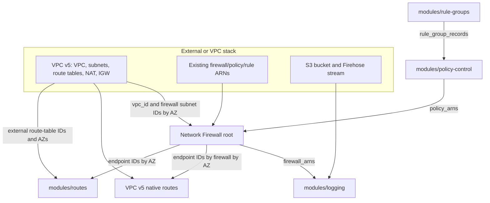

# Module composition

## Ownership rules

- Root: firewall create/inject boundary, placement, protections, and endpoint
  readiness contract.
- Rule groups: structure plus Terraform-managed content, or structure plus
  externally managed live content.
- Policy control: immutable policy releases and incident posture; never rule
  content.
- Logging: one effective logging configuration per firewall and optional
  CloudWatch log groups.
- Routes: only explicitly declared routes in route tables owned elsewhere.
- VPC v5: network primitives and native routes in its state.

Stable maps, rather than provider objects, cross these boundaries. See
[how to use outputs](../how-to-use-outputs.md).
