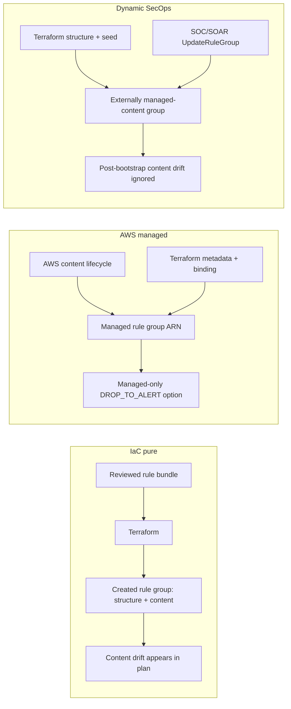
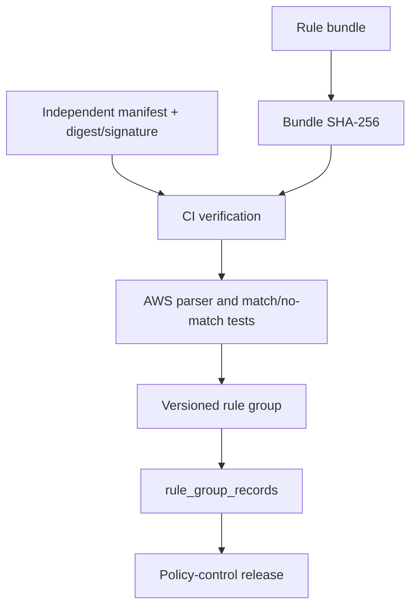

# Rule-management models

`attested` validates evidence shape only. Trust comes from independent production,
signature/digest verification, immutable build context, and reviewed AWS test
results. See [rule management](../rule-management.md).
