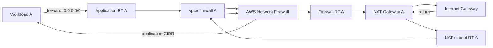
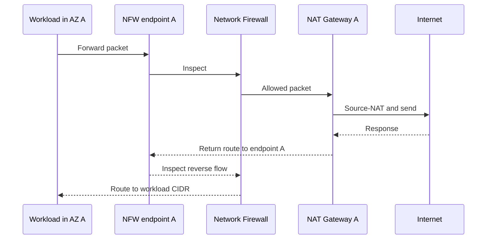

# Zonal traffic flow

AWS Network Firewall endpoints are zonal. A route table must select the endpoint
for its own Availability Zone, and the return path must preserve symmetry.

## Invariants

- Endpoint map keys equal the source route-table AZ set.
- Every source table uses its same-AZ endpoint.
- The route after inspection reaches the intended NAT, TGW, IGW path, or
  destination network.
- Return routes re-enter the same endpoint AZ before reaching the source CIDR.
- TGW centralized inspection uses appliance mode and deliberately designed TGW
  route-table associations/propagations.
- Endpoint readiness and logging health are verified before cutover.

Static Terraform validation cannot prove these invariants against live traffic.
Run per-AZ positive, negative, management-path, and return-path probes.
