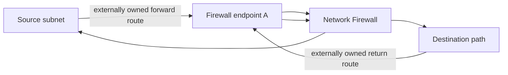

# Basic firewall

Creates one protected AWS Network Firewall in an existing VPC with two caller-owned endpoint subnets. Both endpoint mappings are new dual-stack identities and set `address_family_migration_ack = true`; all state identity comes from the `primary`, `us-east-1a`, and `us-east-1b` keys. Never add that acknowledgement merely to flip an existing mapping—use a new blue/green firewall key.

Replace the example VPC, subnet, and policy ARNs before applying.

```shell
terraform init
terraform plan
```

## Forward and return path



This example creates no routes or logging. Before apply, review Network Firewall
endpoint and dual-stack charges. After apply, wait for both AZ attachments,
compose same-AZ forward/return routes, and verify allowed, denied, management,
IPv4, and IPv6 traffic. Static validation does not prove traffic or AWS resource
existence.
