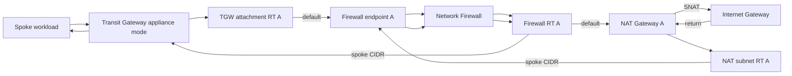

# Centralized inspection with egress routes

This validate-only example adds zonal NAT and Internet Gateway route legs to a
centralized TGW inspection VPC. It demonstrates the order: TGW traffic enters a
same-AZ firewall endpoint, inspection completes, and SNAT occurs afterward at
the same-AZ NAT Gateway. Return traffic re-enters the same firewall endpoint
before reaching the TGW.

> [!WARNING]
> Every ID, ARN, account number, and CIDR is a placeholder. Do not apply this
> example unchanged. Static validation does not prove route ownership, NAT/IGW
> edge behavior, TGW appliance mode, endpoint readiness, or traffic symmetry.

## Architecture and traffic



The source repeats this path in both AZs. SNAT occurs after inspection on the
forward path, and the return route sends the original spoke destination through
inspection before TGW delivery.

## Ownership

| Resource | Owner |
|---|---|
| Inspection VPC, subnets, route tables, NAT Gateways, IGW | External network stack |
| TGW, attachments, appliance mode, TGW route tables | External TGW stack |
| Firewall and endpoints | Root module in this example |
| TGW attachment defaults and NAT return routes to endpoints | `modules/routes` |
| Firewall defaults to NAT and spoke returns to TGW | Direct `aws_route` resources |
| NAT defaults to IGW | Direct `aws_route` resources |
| Firewall policy/rules/logging | External prerequisites |

## Route matrix

| Table (per AZ) | Destination | Target | Direction |
|---|---|---|---|
| TGW attachment subnet | `0.0.0.0/0` | Same-AZ firewall endpoint | Forward into inspection |
| Firewall subnet | `0.0.0.0/0` | Same-AZ NAT Gateway | Forward after inspection |
| NAT/public subnet | `0.0.0.0/0` | IGW | Internet egress |
| NAT/public subnet | `10.0.0.0/8` | Same-AZ firewall endpoint | Return into inspection |
| Firewall subnet | `10.0.0.0/8` | TGW | Return to spoke |
| TGW route tables | Spoke/default prefixes | Topology-specific attachments | External |

## Prerequisites and cost

- Existing multi-AZ inspection VPC, zonal NAT Gateways, IGW, and route tables.
- Existing TGW attachment with appliance mode and reviewed routing.
- Complete, non-overlapping spoke CIDR inventory.
- Existing firewall policy, ALERT/FLOW logging, and rollback path.
- Exclusive route ownership and quotas for two firewall endpoints.

Applying creates billable firewall endpoints and route changes. Existing NAT
Gateways, TGW processing, Network Firewall processing, logs, and cross-AZ data
transfer incur separate charges.

## Run and verify

```shell
terraform init
terraform validate
terraform plan -out=tfplan
```

Replace placeholders and compare the saved plan with the route matrix. After an
approved apply:

1. confirm endpoint and TGW attachment health in both AZs;
2. verify allowed Internet egress and observed source-NAT address;
3. verify the return flow traverses the same endpoint AZ;
4. test expected deny/alert traffic and log delivery;
5. probe DNS, identity, time sync, monitoring, and management paths;
6. check for unexpected cross-AZ charges or asymmetric resets.

Static validation does not prove any dataplane result.
