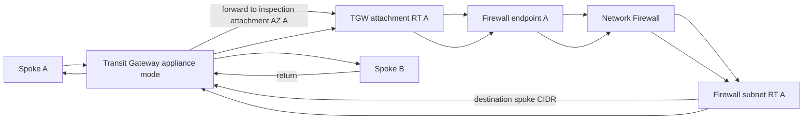

# Centralized inspection without egress routes

This validate-only example shows the inspection-VPC route legs for centralized
east-west traffic through a Transit Gateway (TGW), without NAT or Internet
egress. TGW attachments, appliance mode, TGW route tables, VPC route tables, and
spoke routes already exist.

> [!WARNING]
> Every ID, ARN, account number, and CIDR is a placeholder. Do not apply this
> example unchanged. Static validation does not prove TGW association,
> propagation, appliance mode, attachment health, route ownership, or symmetric
> traffic.

## Architecture and traffic



The route shape is repeated per AZ. TGW appliance mode preserves the selected
inspection AZ for the life of the flow.

## Ownership

| Resource | Owner |
|---|---|
| Existing inspection VPC, subnets, tables, associations | External network stack |
| TGW, attachments, appliance mode, TGW associations/propagations | External TGW stack |
| Firewall and endpoints | Root module in this example |
| TGW attachment-table routes to endpoints | `modules/routes` in this example |
| Firewall-table routes back to TGW | Direct `aws_route` resources in this example |
| Firewall policy/rules/logging | External prerequisites |

## Route matrix

| Table (per AZ) | Destination | Target | Direction |
|---|---|---|---|
| TGW attachment subnet | `10.0.0.0/8` spoke inventory | Same-AZ firewall endpoint | TGW to firewall |
| Firewall subnet | `10.0.0.0/8` spoke inventory | TGW | Firewall to destination/return TGW |
| TGW route tables | Spoke and inspection prefixes | Attachments selected by topology | External, both directions |

A production design should use non-overlapping per-spoke prefixes rather than an
overly broad aggregate when route intent requires finer control.

## Prerequisites and cost

- Existing TGW attachment with appliance mode enabled.
- Complete spoke CIDR inventory and reviewed TGW route-table design.
- Dedicated firewall subnets and external route tables in each AZ.
- Existing firewall policy and logging/monitoring.
- Confirmed exclusive ownership of every route-table/destination pair.

Applying creates two billable firewall endpoints plus any route changes. TGW and
cross-AZ data-processing charges can apply. This example creates no TGW.

## Run and verify

```shell
terraform init
terraform validate
terraform plan -out=tfplan
```

Replace placeholders and review the plan against the route matrix before apply.
Then verify:

1. all firewall attachments are ready;
2. TGW appliance mode and intended associations/propagations are active;
3. forward and return flows traverse the same endpoint AZ;
4. allowed spoke-to-spoke traffic succeeds;
5. intentionally denied traffic is logged and blocked;
6. management and monitoring paths remain reachable.

Static validation proves none of these runtime conditions.
