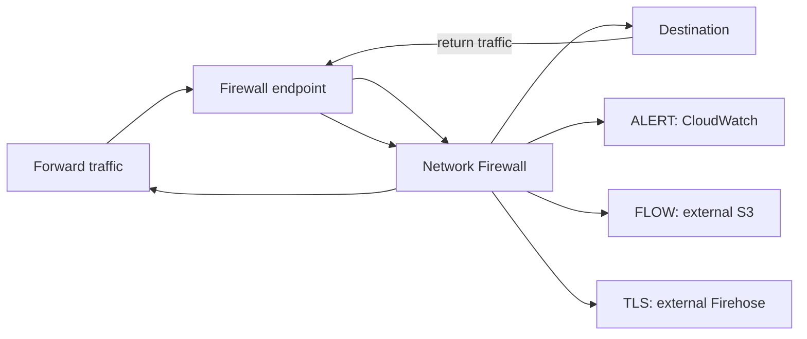

# Firewall with complete logging

Creates one firewall, one CloudWatch log group, and one logging configuration containing ALERT, FLOW, and TLS destinations. The S3 bucket and Firehose delivery stream are injected because their durable storage, IAM, encryption, and retention lifecycles remain externally owned.

Replace the example VPC, subnet, policy, bucket, and delivery-stream values before applying.

```shell
terraform init
terraform plan
```

## Traffic and telemetry flow



The firewall and CloudWatch log group incur charges; S3 and Firehose resources
must already exist with correct service permissions. This example creates no
routes. After apply, verify forward/return traffic separately and confirm all
three destinations receive current records. Static validation cannot verify
destination existence, permissions, delivery, or traffic.
