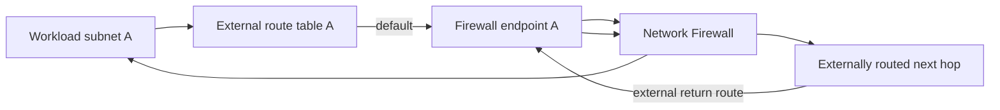

# Complete routes composition

Creates a two-AZ IPv4 firewall and composes its Tier 1 endpoint map into `modules/routes`. Each workload route selects the endpoint in the same Availability Zone and explicitly acknowledges that the route table is externally owned.

Replace every illustrative ID/ARN before apply. Confirm that no other Terraform state owns either `route_table_id + destination` identity; `acknowledge_external_route_table = true` is a responsibility boundary, not discovery.

## Forward and return path

| Resource | Owner |
|---|---|
| Firewall and endpoints | Root module |
| Two declared workload default routes | `modules/routes` |
| Route tables, associations, post-firewall and return routes | External network stack |
| Policy, rules, and logging | External prerequisites |

Firewall endpoint charges apply if this example is applied. Run
`terraform init`, `terraform validate`, and a saved `terraform plan` only after
replacing placeholders. Verify attachment health and both traffic directions in
each AZ; static validation does not prove exclusive route ownership or traffic.
