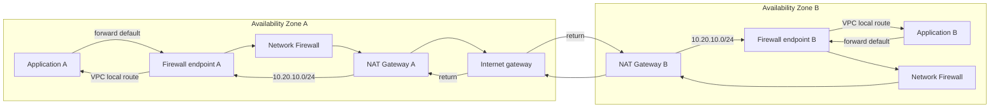

# End-to-end VPC v5 inspection

This is the integrated golden path: AWS IA VPC v5 creates a two-AZ VPC,
application/firewall/public subnets, zonal NAT Gateways, and native routes;
Network Firewall v2 creates a rule group, immutable policy release, firewall,
ALERT/FLOW CloudWatch logging, and AZ-keyed endpoint composition.

> [!WARNING]
> The HCL uses the future canonical `aws-ia/vpc/aws` v5 Registry source. Until
> that release is available, `scripts/validate-examples.sh` rewrites only the VPC
> module source/version to `tests/fixtures/vpc-v5-contract`. The fixture creates
> no resources and proves only the documented input/output shape. Static
> validation does not prove AWS acceptance, route symmetry, or traffic.

All names, evidence locations, digests, account IDs, CIDRs, and Regions are
illustrative. Replace them and complete a security review before plan or apply.

## Architecture and traffic



The source uses the application group's computed `/24` (`10.20.10.0/24`) for the
more-specific public-subnet return route. Confirm actual generated CIDRs before
apply.

## Ownership

| Resource | Owner in this example |
|---|---|
| VPC, CIDR, subnets, route tables, NAT Gateways, IGW, native routes | VPC v5 |
| Rule-group structure/content | `modules/rule-groups` (IaC pure) |
| Policy release and enforcement posture | `modules/policy-control` |
| Firewall placement/endpoints | Root module |
| ALERT/FLOW log groups and firewall logging association | `modules/logging` |
| Independent rule validation evidence | External security release system |

## Route matrix

| Route-table group | Destination | Target | Direction |
|---|---|---|---|
| Application, each AZ | `0.0.0.0/0` | Same-AZ firewall endpoint | Forward into inspection |
| Firewall, each AZ | `0.0.0.0/0` | Same-AZ NAT Gateway | Forward after inspection |
| Public/NAT, each AZ | `0.0.0.0/0` | Internet Gateway | Internet egress |
| Public/NAT, each AZ | `10.20.10.0/24` | Same-AZ firewall endpoint | Return into inspection |
| VPC local | Application CIDR | Local | Return after inspection |

## Prerequisites and cost

- A published VPC v5 release or a reviewed source for evaluation.
- AWS credentials and permissions for VPC, EC2, Network Firewall, and CloudWatch.
- Independent rule-bundle validation evidence and reviewed `HOME_NET`.
- Service quotas for two firewall endpoints, rule group, and policy.

Applying creates two billable Network Firewall endpoints, two NAT Gateways, log
groups, and traffic/data-processing charges. `terraform init` and
`terraform validate` create no AWS resources.

## Run and verify

For repository/static validation:

```shell
./scripts/validate-examples.sh
```

For an actual deployment, use a copied directory with real evidence and an
available VPC module source:

```shell
terraform init
terraform validate
terraform plan -out=tfplan
```

Before apply, inspect every route and expected replacement. After apply:

1. Wait for both firewall attachments to report ready.
2. Confirm ALERT and FLOW log delivery.
3. Probe allowed outbound traffic from each AZ.
4. Send traffic expected to match SID `4200001` and confirm the alert.
5. Probe return traffic, DNS, identity, time sync, and management paths.
6. Confirm no unexpected cross-AZ path.

A successful static validation does not establish any of these runtime results.
