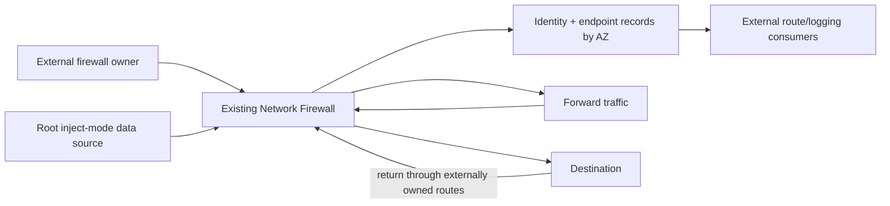

# Observe an existing firewall

This example sets `create = false` and reads an existing AWS Network Firewall by
ARN. It publishes normalized Tier 1 identity, policy, endpoint, and readiness
records without adopting lifecycle ownership.

> [!WARNING]
> The default ARN is a placeholder. `terraform validate` succeeds without AWS,
> but `plan` requires a real firewall in the configured account and Region.
> Static validation does not prove the observed firewall is ready or correctly
> routed.

## Architecture and traffic



Inject mode observes configuration. Forward and return routes remain wholly
external and must already preserve same-AZ symmetry.

## Ownership

| Concern | Owner |
|---|---|
| Firewall lifecycle, policy binding, protections, endpoint mappings | External firewall state/team |
| Read-only lookup and normalized outputs | This root module instance |
| Forward/return routes | External network state/team |
| Rule groups, policy releases, logging configuration | External unless separately composed |
| Runtime attachment/readiness verification | Operator |

## Route matrix

This example creates no routes.

| Route leg | Required owner | Verification |
|---|---|---|
| Source to same-AZ firewall endpoint | External | Route-table and flow inspection |
| Firewall to destination | External | Route-table/TGW/NAT inspection |
| Destination return to same-AZ endpoint | External | Reverse-flow and AZ check |
| Firewall return to source | External | Positive/negative traffic probes |

## Prerequisites and cost

- Existing firewall ARN and read permissions.
- AWS credentials for plan/read.
- External owner approval to consume endpoint outputs.
- Documented route, policy, logging, and incident owners.

This example creates no firewall, but reading/composing it does not eliminate the
existing firewall's endpoint and processing charges.

## Run and verify

```shell
terraform init
terraform validate
terraform plan
```

After replacing the ARN:

1. confirm observed ID, name, VPC, policy ARN, and requested AZ set;
2. check AWS `SyncStates` and attachment status directly;
3. compare endpoint IDs with external route targets by AZ;
4. verify ALERT/FLOW logging under the external owner;
5. run allowed, denied, management, and return-path probes.

Inject-mode endpoint records are deliberately unverified. A successful plan does
not establish health or ownership.
