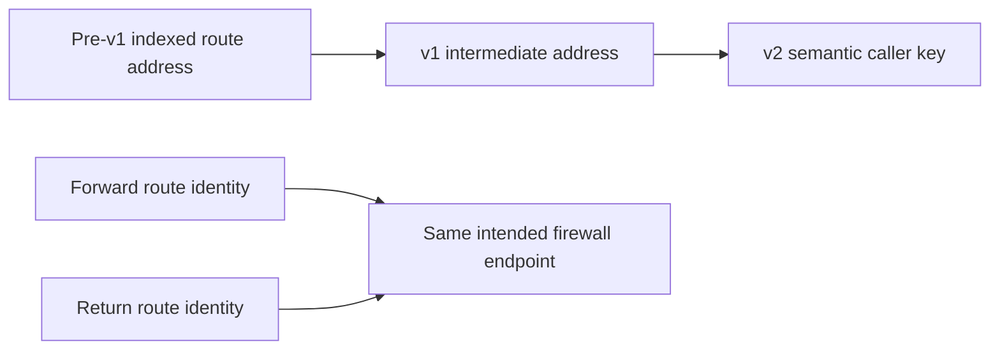

# Pre-v1 central route migration

This executable migration fixture preserves all twelve historical route addresses: six `centralized_inspection_with_egress` routes and six `centralized_inspection_without_egress` routes. Copy and adapt `moved.tf` in the caller root, keeping both old→v1 and v1→semantic-key links. The native migration suite seeds every historical index and explicitly asserts boundary indices 0 and 5 for both families.

The IDs and CIDRs in `main.tf` are deterministic test values. Replace them from the captured v1 state before using the pattern in a real migration.

## Address transition and preserved traffic intent

The migration changes Terraform addresses, not the intended forward/return path.
Rehearse on copied state, save the plan, and require zero delete/replace actions
plus exact approval for create/update/forget actions. Static fixture validation
does not prove that caller state uses the same historical ordering or IDs.
