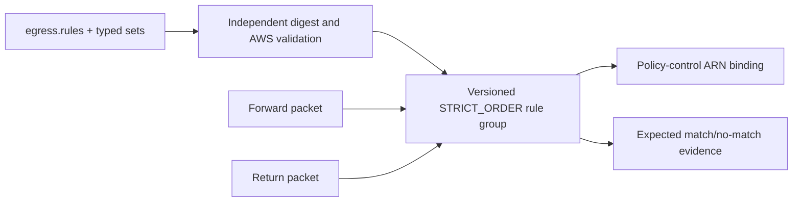

# Suricata rule group

Creates one STRICT_ORDER rule group from `egress.rules`, with environment bindings supplied through typed IP and port sets. The `manifest_uri` and digest represent an external CI artifact; replace both with evidence produced by the rule validation pipeline before apply. Do not derive the expected digest from the same local file inside this configuration.

## Content and packet flow

Terraform checks the closed source lane, set references, capacity, SID range,
and attestation shape. AWS remains the full Suricata parser, and Terraform cannot
prove that evidence is independent. Applying creates a billable rule group.
Run match and no-match tests for both flow directions and integrate the output
record directly with `modules/policy-control`; static validation does not prove
rule semantics or traffic.
